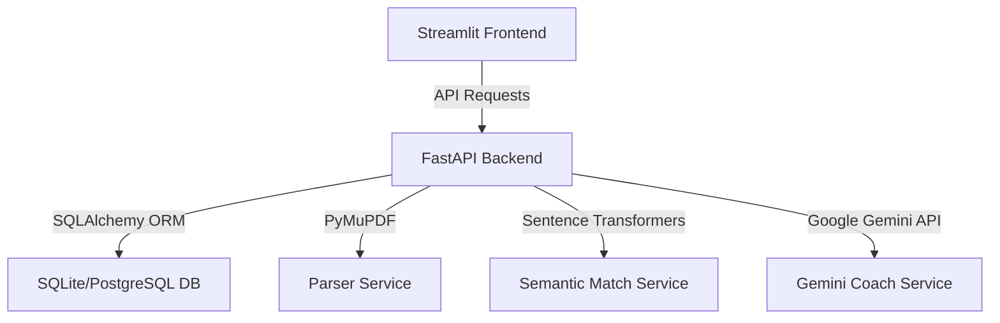

# AI Resume Analyzer & Interview Coach 💼

An AI-powered, production-grade full-stack platform designed to optimize resumes for Applicant Tracking Systems (ATS), evaluate semantic alignment, and prepare candidates for technical and behavioral interviews through interactive AI simulation.

---

## 🌟 Key Features

1. **Structured Resume Parser (PDF):** Extracts raw text from PDF files using `PyMuPDF` and structures the profile (Contact, Skills, Education, Experience) using Google Gemini API JSON Schema (with a robust local regex/keyword fallback).
2. **Deterministic ATS Engine:** Calculates compatibility based on a weighted 4-factor algorithm:
   *   **Skill Match (40%):** Compares candidate's skills against job description expectations.
   *   **Keyword Match (30%):** Measures noun and technical keyword frequencies.
   *   **Experience Match (20%):** Matches candidate's parsed years of experience against job requirements.
   *   **Education Match (10%):** Evaluates educational degree compatibility.
3. **Semantic Similarity Scorer:** Computes conceptual alignment using `sentence-transformers` (`all-MiniLM-L6-v2`) with a dual-mode fallback (Gemini or TF-IDF Cosine Similarity) to ensure zero-downtime startups.
4. **AI Coach & Optimizer:** Prompt-engineered Google Gemini integrations that suggest:
   *   Weak sections to fix.
   *   Google-style **X-Y-Z formula** bullet point rewrites.
   *   Stronger action verbs.
   *   Custom **Beginner ➡️ Intermediate ➡️ Advanced** learning paths.
5. **Interactive Interview Simulator:** Generates custom technical (by skill) and behavioral (STAR method) questions across Easy/Medium/Hard difficulties, featuring an **Interactive Practice Sandbox** that gives instant feedback on user-typed answers.
6. **Full-Featured Portfolio Dashboard:** Beautiful multi-tab dark-mode Streamlit dashboard featuring Plotly indicators (Radar, Bar, Gauge, and Pie charts).

---

## 🏗️ Architecture



---

## 🚀 Quick Start Guide

### Prerequisites
*   Python 3.12 (Recommended for pre-built package wheels)
*   Google Gemini API Key (Get one from Google AI Studio)

### Local Setup

1.  **Clone or navigate to the directory:**
    ```bash
    cd /Users/pranav/Desktop/ai_resume_analyzer
    ```

2.  **Create and activate a virtual environment:**
    ```bash
    python3.12 -m venv venv
    source venv/bin/activate
    ```

3.  **Install dependencies:**
    ```bash
    pip install -r requirements.txt
    ```

4.  **Configure environment variables:**
    Create a `.env` file at the root of the project:
    ```env
    GEMINI_API_KEY=your_actual_gemini_api_key_here
    DATABASE_URL=sqlite:///data/analysis/resume_analyzer.db
    ```

5.  **Start the FastAPI Backend:**
    ```bash
    python -m src.api.main
    ```
    The API will start at `http://localhost:8000`. You can view the interactive Swagger docs at `http://localhost:8000/docs`.

6.  **Start the Streamlit Frontend Dashboard:**
    Open a new terminal, activate the virtual environment, and run:
    ```bash
    streamlit run src/web_app/app.py
    ```
    The web interface will launch at `http://localhost:8501`.

---

## 🐳 Docker Deployment

The application is fully containerized and deployment-ready.

1.  **Build and run both containers (FastAPI + Streamlit):**
    ```bash
    GEMINI_API_KEY=your_api_key_here docker-compose up --build
    ```
2.  Access the web application at `http://localhost:8501` and the API at `http://localhost:8000`.

---

## 📖 API Documentation

### `POST /api/upload-resume`
Uploads a PDF resume, parses its details, registers its skills, and saves it in the database.
*   **Request:** Multipart Form (`file`: PDF file)
*   **Response:** JSON structured profile including `resume_id`.

### `POST /api/analyze`
Performs comprehensive ATS calculations, semantic matching, and generates suggestions, learning paths, and interview questions.
*   **Request Body:**
    ```json
    {
      "resume_id": 1,
      "job_title": "Software Engineer",
      "job_description": "We need a Python developer who knows SQL and Docker..."
    }
    ```
*   **Response:** Complete analysis payload containing scores, missing skills, suggestions, and interview questions.

### `POST /api/generate-interview-questions`
Directly generates interview questions for a list of skills.
*   **Request Body:** `{"skills": ["fastapi", "docker"]}`
*   **Response:** Technical and behavioral questions.

### `GET /api/history`
Returns history of all uploaded resumes and past analysis summaries.

### `GET /api/analysis/{id}`
Retrieves a completed analysis record by ID.
